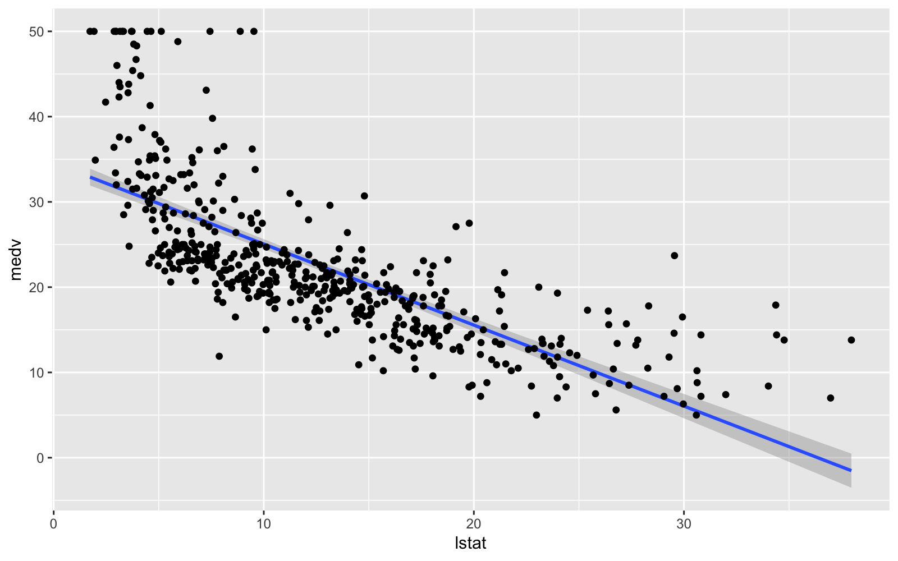

# Chapter 3 Lab


```r
knitr::opts_chunk$set(dpi = 200, fig.width = 8, fig.height = 5, message = F, warning = F)

library(MASS)
library(ISLR)
library(tidyverse)
library(tidymodels)
library(expappr)
library(ggfortify)
library(gridExtra)
library(car)

options(scipen=999)

#ezspin_pt(file_name = "ch3", project_directory = ".", file_folder = "munge", keep_html = F)

head(Boston)
```

```
##      crim zn indus chas   nox    rm  age    dis rad tax ptratio  black
## 1 0.00632 18  2.31    0 0.538 6.575 65.2 4.0900   1 296    15.3 396.90
## 2 0.02731  0  7.07    0 0.469 6.421 78.9 4.9671   2 242    17.8 396.90
## 3 0.02729  0  7.07    0 0.469 7.185 61.1 4.9671   2 242    17.8 392.83
## 4 0.03237  0  2.18    0 0.458 6.998 45.8 6.0622   3 222    18.7 394.63
## 5 0.06905  0  2.18    0 0.458 7.147 54.2 6.0622   3 222    18.7 396.90
## 6 0.02985  0  2.18    0 0.458 6.430 58.7 6.0622   3 222    18.7 394.12
##   lstat medv
## 1  4.98 24.0
## 2  9.14 21.6
## 3  4.03 34.7
## 4  2.94 33.4
## 5  5.33 36.2
## 6  5.21 28.7
```

```r
lm_fit <- lm(medv ~ lstat, data = Boston)

Boston %>% lm(medv ~ lstat, .) %>% glance()
```

```
## # A tibble: 1 x 11
##   r.squared adj.r.squared sigma statistic  p.value    df logLik   AIC   BIC
## *     <dbl>         <dbl> <dbl>     <dbl>    <dbl> <int>  <dbl> <dbl> <dbl>
## 1     0.544         0.543  6.22      602. 5.08e-88     2 -1641. 3289. 3302.
## # ... with 2 more variables: deviance <dbl>, df.residual <int>
```

```r
## base R model metrics
summary(lm_fit)
```

```
## 
## Call:
## lm(formula = medv ~ lstat, data = Boston)
## 
## Residuals:
##     Min      1Q  Median      3Q     Max 
## -15.168  -3.990  -1.318   2.034  24.500 
## 
## Coefficients:
##             Estimate Std. Error t value            Pr(>|t|)    
## (Intercept) 34.55384    0.56263   61.41 <0.0000000000000002 ***
## lstat       -0.95005    0.03873  -24.53 <0.0000000000000002 ***
## ---
## Signif. codes:  0 '***' 0.001 '**' 0.01 '*' 0.05 '.' 0.1 ' ' 1
## 
## Residual standard error: 6.216 on 504 degrees of freedom
## Multiple R-squared:  0.5441,	Adjusted R-squared:  0.5432 
## F-statistic: 601.6 on 1 and 504 DF,  p-value: < 0.00000000000000022
```

```r
names(lm_fit)
```

```
##  [1] "coefficients"  "residuals"     "effects"       "rank"         
##  [5] "fitted.values" "assign"        "qr"            "df.residual"  
##  [9] "xlevels"       "call"          "terms"         "model"
```

```r
## broom methods
tidy(lm_fit)
```

```
## # A tibble: 2 x 5
##   term        estimate std.error statistic   p.value
##   <chr>          <dbl>     <dbl>     <dbl>     <dbl>
## 1 (Intercept)   34.6      0.563       61.4 3.74e-236
## 2 lstat         -0.950    0.0387     -24.5 5.08e- 88
```

```r
glance(lm_fit)
```

```
## # A tibble: 1 x 11
##   r.squared adj.r.squared sigma statistic  p.value    df logLik   AIC   BIC
## *     <dbl>         <dbl> <dbl>     <dbl>    <dbl> <int>  <dbl> <dbl> <dbl>
## 1     0.544         0.543  6.22      602. 5.08e-88     2 -1641. 3289. 3302.
## # ... with 2 more variables: deviance <dbl>, df.residual <int>
```

```r
## base (can transform to a datafram)
confint(lm_fit) 
```

```
##                 2.5 %     97.5 %
## (Intercept) 33.448457 35.6592247
## lstat       -1.026148 -0.8739505
```

```r
## tidy
confint_tidy(lm_fit)
```

```
## # A tibble: 2 x 2
##   conf.low conf.high
##      <dbl>     <dbl>
## 1    33.4     35.7  
## 2    -1.03    -0.874
```

```r
Boston %>% 
  lm(medv ~ lstat, .) %>% 
  augment()
```

```
## # A tibble: 506 x 9
##     medv lstat .fitted .se.fit  .resid    .hat .sigma   .cooksd .std.resid
##  * <dbl> <dbl>   <dbl>   <dbl>   <dbl>   <dbl>  <dbl>     <dbl>      <dbl>
##  1  24    4.98   29.8    0.406  -5.82  0.00426   6.22   1.89e-3    -0.939 
##  2  21.6  9.14   25.9    0.308  -4.27  0.00246   6.22   5.82e-4    -0.688 
##  3  34.7  4.03   30.7    0.433   3.97  0.00486   6.22   1.00e-3     0.641 
##  4  33.4  2.94   31.8    0.467   1.64  0.00564   6.22   1.98e-4     0.264 
##  5  36.2  5.33   29.5    0.396   6.71  0.00406   6.21   2.38e-3     1.08  
##  6  28.7  5.21   29.6    0.399  -0.904 0.00413   6.22   4.40e-5    -0.146 
##  7  22.9 12.4    22.7    0.276   0.155 0.00198   6.22   6.20e-7     0.0250
##  8  27.1 19.2    16.4    0.374  10.7   0.00362   6.20   5.44e-3     1.73  
##  9  16.5 29.9     6.12   0.724  10.4   0.0136    6.20   1.94e-2     1.68  
## 10  18.9 17.1    18.3    0.326   0.592 0.00274   6.22   1.25e-5     0.0954
## # ... with 496 more rows
```

```r
ggplot(Boston, aes(x=lstat, y=medv)) +
  geom_smooth(method = "lm") +
  geom_point()
```



## 3.6.3 Multiple Linear Regression


```r
ml_fit <- Boston %>% 
  lm(medv ~ ., .)

ml_fit %>% summary()
```

```
## 
## Call:
## lm(formula = medv ~ ., data = .)
## 
## Residuals:
##     Min      1Q  Median      3Q     Max 
## -15.595  -2.730  -0.518   1.777  26.199 
## 
## Coefficients:
##                Estimate  Std. Error t value             Pr(>|t|)    
## (Intercept)  36.4594884   5.1034588   7.144    0.000000000003283 ***
## crim         -0.1080114   0.0328650  -3.287             0.001087 ** 
## zn            0.0464205   0.0137275   3.382             0.000778 ***
## indus         0.0205586   0.0614957   0.334             0.738288    
## chas          2.6867338   0.8615798   3.118             0.001925 ** 
## nox         -17.7666112   3.8197437  -4.651    0.000004245643808 ***
## rm            3.8098652   0.4179253   9.116 < 0.0000000000000002 ***
## age           0.0006922   0.0132098   0.052             0.958229    
## dis          -1.4755668   0.1994547  -7.398    0.000000000000601 ***
## rad           0.3060495   0.0663464   4.613    0.000005070529023 ***
## tax          -0.0123346   0.0037605  -3.280             0.001112 ** 
## ptratio      -0.9527472   0.1308268  -7.283    0.000000000001309 ***
## black         0.0093117   0.0026860   3.467             0.000573 ***
## lstat        -0.5247584   0.0507153 -10.347 < 0.0000000000000002 ***
## ---
## Signif. codes:  0 '***' 0.001 '**' 0.01 '*' 0.05 '.' 0.1 ' ' 1
## 
## Residual standard error: 4.745 on 492 degrees of freedom
## Multiple R-squared:  0.7406,	Adjusted R-squared:  0.7338 
## F-statistic: 108.1 on 13 and 492 DF,  p-value: < 0.00000000000000022
```

```r
vif(ml_fit)
```

```
##     crim       zn    indus     chas      nox       rm      age      dis 
## 1.792192 2.298758 3.991596 1.073995 4.393720 1.933744 3.100826 3.955945 
##      rad      tax  ptratio    black    lstat 
## 7.484496 9.008554 1.799084 1.348521 2.941491
```

## 3.6.4 Interaction Terms


```r
## this includes lstat, age, and the interaction between the 2 variable
summary(lm(medv~lstat*age, data=Boston))
```

```
## 
## Call:
## lm(formula = medv ~ lstat * age, data = Boston)
## 
## Residuals:
##     Min      1Q  Median      3Q     Max 
## -15.806  -4.045  -1.333   2.085  27.552 
## 
## Coefficients:
##               Estimate Std. Error t value             Pr(>|t|)    
## (Intercept) 36.0885359  1.4698355  24.553 < 0.0000000000000002 ***
## lstat       -1.3921168  0.1674555  -8.313 0.000000000000000878 ***
## age         -0.0007209  0.0198792  -0.036               0.9711    
## lstat:age    0.0041560  0.0018518   2.244               0.0252 *  
## ---
## Signif. codes:  0 '***' 0.001 '**' 0.01 '*' 0.05 '.' 0.1 ' ' 1
## 
## Residual standard error: 6.149 on 502 degrees of freedom
## Multiple R-squared:  0.5557,	Adjusted R-squared:  0.5531 
## F-statistic: 209.3 on 3 and 502 DF,  p-value: < 0.00000000000000022
```

