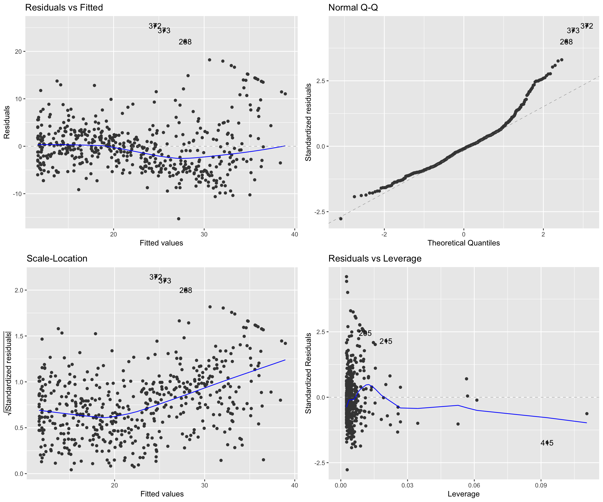
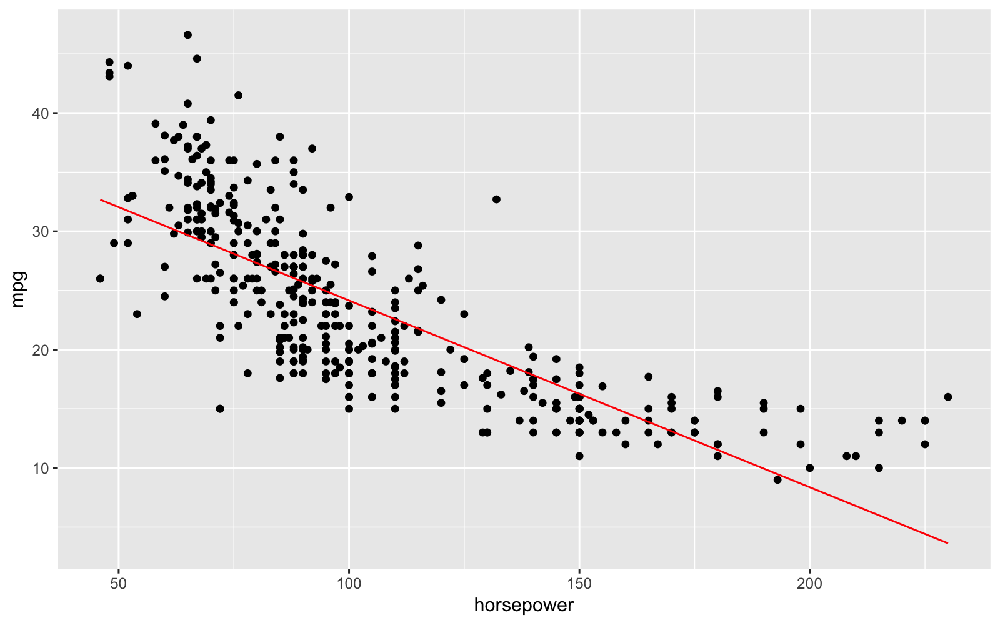
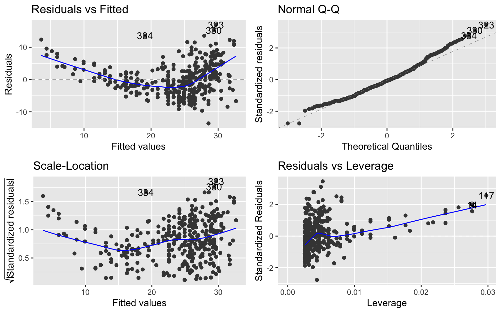
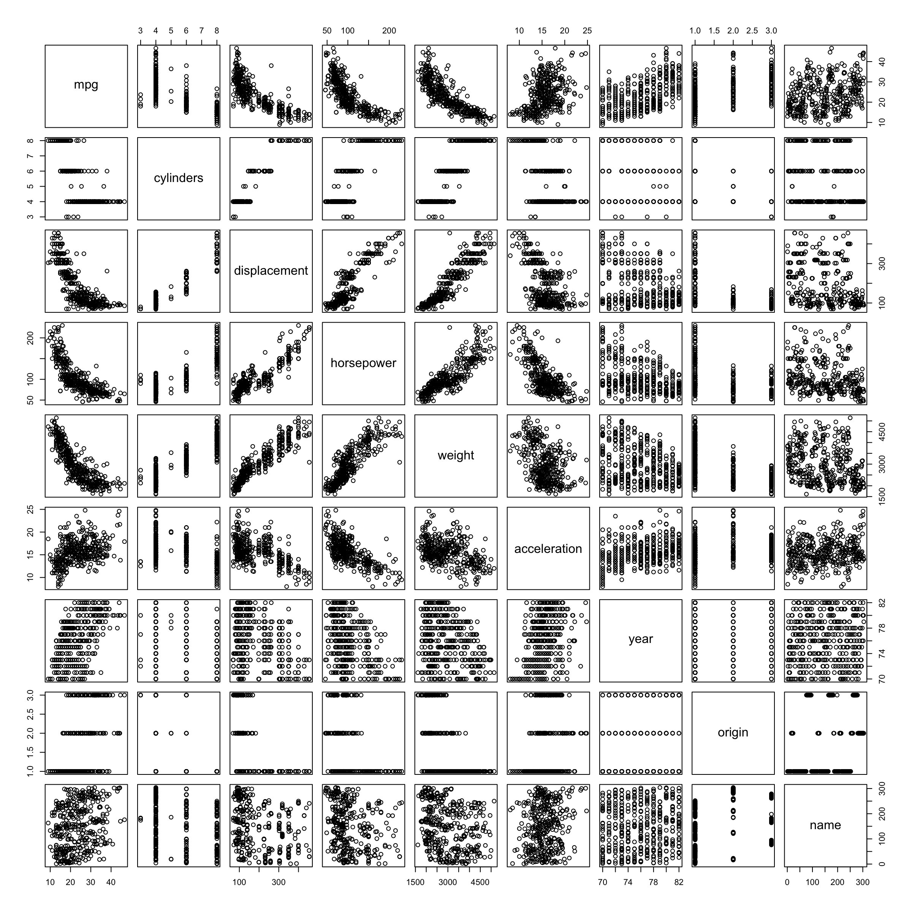
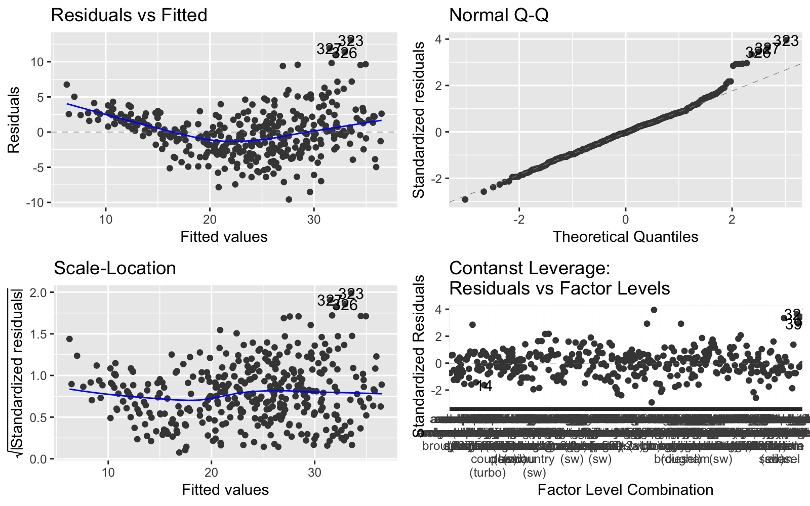

# Chapter 3 Lab


```r
knitr::opts_chunk$set(dpi = 200, fig.width = 8, fig.height = 5, message = F, warning = F)

library(MASS)
library(ISLR)
library(tidyverse)
library(tidymodels)
library(expappr)
library(ggfortify)
library(gridExtra)
library(car)
library(modelr)

options(scipen=999)

#ezspin_pt(file_name = "ch3", project_directory = ".", file_folder = "munge", keep_html = F)

head(Boston)
```

```
##      crim zn indus chas   nox    rm  age    dis rad tax ptratio  black
## 1 0.00632 18  2.31    0 0.538 6.575 65.2 4.0900   1 296    15.3 396.90
## 2 0.02731  0  7.07    0 0.469 6.421 78.9 4.9671   2 242    17.8 396.90
## 3 0.02729  0  7.07    0 0.469 7.185 61.1 4.9671   2 242    17.8 392.83
## 4 0.03237  0  2.18    0 0.458 6.998 45.8 6.0622   3 222    18.7 394.63
## 5 0.06905  0  2.18    0 0.458 7.147 54.2 6.0622   3 222    18.7 396.90
## 6 0.02985  0  2.18    0 0.458 6.430 58.7 6.0622   3 222    18.7 394.12
##   lstat medv
## 1  4.98 24.0
## 2  9.14 21.6
## 3  4.03 34.7
## 4  2.94 33.4
## 5  5.33 36.2
## 6  5.21 28.7
```

```r
lm_fit <- lm(medv ~ lstat, data = Boston)

Boston %>% lm(medv ~ lstat, .) %>% glance()
```

```
## # A tibble: 1 x 11
##   r.squared adj.r.squared sigma statistic  p.value    df logLik   AIC   BIC
## *     <dbl>         <dbl> <dbl>     <dbl>    <dbl> <int>  <dbl> <dbl> <dbl>
## 1     0.544         0.543  6.22      602. 5.08e-88     2 -1641. 3289. 3302.
## # ... with 2 more variables: deviance <dbl>, df.residual <int>
```

```r
## base R model metrics
summary(lm_fit)
```

```
## 
## Call:
## lm(formula = medv ~ lstat, data = Boston)
## 
## Residuals:
##     Min      1Q  Median      3Q     Max 
## -15.168  -3.990  -1.318   2.034  24.500 
## 
## Coefficients:
##             Estimate Std. Error t value            Pr(>|t|)    
## (Intercept) 34.55384    0.56263   61.41 <0.0000000000000002 ***
## lstat       -0.95005    0.03873  -24.53 <0.0000000000000002 ***
## ---
## Signif. codes:  0 '***' 0.001 '**' 0.01 '*' 0.05 '.' 0.1 ' ' 1
## 
## Residual standard error: 6.216 on 504 degrees of freedom
## Multiple R-squared:  0.5441,	Adjusted R-squared:  0.5432 
## F-statistic: 601.6 on 1 and 504 DF,  p-value: < 0.00000000000000022
```

```r
names(lm_fit)
```

```
##  [1] "coefficients"  "residuals"     "effects"       "rank"         
##  [5] "fitted.values" "assign"        "qr"            "df.residual"  
##  [9] "xlevels"       "call"          "terms"         "model"
```

```r
## broom methods
tidy(lm_fit)
```

```
## # A tibble: 2 x 5
##   term        estimate std.error statistic   p.value
##   <chr>          <dbl>     <dbl>     <dbl>     <dbl>
## 1 (Intercept)   34.6      0.563       61.4 3.74e-236
## 2 lstat         -0.950    0.0387     -24.5 5.08e- 88
```

```r
glance(lm_fit)
```

```
## # A tibble: 1 x 11
##   r.squared adj.r.squared sigma statistic  p.value    df logLik   AIC   BIC
## *     <dbl>         <dbl> <dbl>     <dbl>    <dbl> <int>  <dbl> <dbl> <dbl>
## 1     0.544         0.543  6.22      602. 5.08e-88     2 -1641. 3289. 3302.
## # ... with 2 more variables: deviance <dbl>, df.residual <int>
```

```r
## base (can transform to a datafram)
confint(lm_fit) 
```

```
##                 2.5 %     97.5 %
## (Intercept) 33.448457 35.6592247
## lstat       -1.026148 -0.8739505
```

```r
## tidy
confint_tidy(lm_fit)
```

```
## # A tibble: 2 x 2
##   conf.low conf.high
##      <dbl>     <dbl>
## 1    33.4     35.7  
## 2    -1.03    -0.874
```

```r
Boston %>% 
  lm(medv ~ lstat, .) %>% 
  augment()
```

```
## # A tibble: 506 x 9
##     medv lstat .fitted .se.fit  .resid    .hat .sigma   .cooksd .std.resid
##  * <dbl> <dbl>   <dbl>   <dbl>   <dbl>   <dbl>  <dbl>     <dbl>      <dbl>
##  1  24    4.98   29.8    0.406  -5.82  0.00426   6.22   1.89e-3    -0.939 
##  2  21.6  9.14   25.9    0.308  -4.27  0.00246   6.22   5.82e-4    -0.688 
##  3  34.7  4.03   30.7    0.433   3.97  0.00486   6.22   1.00e-3     0.641 
##  4  33.4  2.94   31.8    0.467   1.64  0.00564   6.22   1.98e-4     0.264 
##  5  36.2  5.33   29.5    0.396   6.71  0.00406   6.21   2.38e-3     1.08  
##  6  28.7  5.21   29.6    0.399  -0.904 0.00413   6.22   4.40e-5    -0.146 
##  7  22.9 12.4    22.7    0.276   0.155 0.00198   6.22   6.20e-7     0.0250
##  8  27.1 19.2    16.4    0.374  10.7   0.00362   6.20   5.44e-3     1.73  
##  9  16.5 29.9     6.12   0.724  10.4   0.0136    6.20   1.94e-2     1.68  
## 10  18.9 17.1    18.3    0.326   0.592 0.00274   6.22   1.25e-5     0.0954
## # ... with 496 more rows
```

```r
ggplot(Boston, aes(x=lstat, y=medv)) +
  geom_smooth(method = "lm") +
  geom_point()
```


## 3.6.3 Multiple Linear Regression


```r
ml_fit <- Boston %>% 
  lm(medv ~ ., .)

ml_fit %>% summary()
```

```
## 
## Call:
## lm(formula = medv ~ ., data = .)
## 
## Residuals:
##     Min      1Q  Median      3Q     Max 
## -15.595  -2.730  -0.518   1.777  26.199 
## 
## Coefficients:
##                Estimate  Std. Error t value             Pr(>|t|)    
## (Intercept)  36.4594884   5.1034588   7.144    0.000000000003283 ***
## crim         -0.1080114   0.0328650  -3.287             0.001087 ** 
## zn            0.0464205   0.0137275   3.382             0.000778 ***
## indus         0.0205586   0.0614957   0.334             0.738288    
## chas          2.6867338   0.8615798   3.118             0.001925 ** 
## nox         -17.7666112   3.8197437  -4.651    0.000004245643808 ***
## rm            3.8098652   0.4179253   9.116 < 0.0000000000000002 ***
## age           0.0006922   0.0132098   0.052             0.958229    
## dis          -1.4755668   0.1994547  -7.398    0.000000000000601 ***
## rad           0.3060495   0.0663464   4.613    0.000005070529023 ***
## tax          -0.0123346   0.0037605  -3.280             0.001112 ** 
## ptratio      -0.9527472   0.1308268  -7.283    0.000000000001309 ***
## black         0.0093117   0.0026860   3.467             0.000573 ***
## lstat        -0.5247584   0.0507153 -10.347 < 0.0000000000000002 ***
## ---
## Signif. codes:  0 '***' 0.001 '**' 0.01 '*' 0.05 '.' 0.1 ' ' 1
## 
## Residual standard error: 4.745 on 492 degrees of freedom
## Multiple R-squared:  0.7406,	Adjusted R-squared:  0.7338 
## F-statistic: 108.1 on 13 and 492 DF,  p-value: < 0.00000000000000022
```

```r
vif(ml_fit)
```

```
##     crim       zn    indus     chas      nox       rm      age      dis 
## 1.792192 2.298758 3.991596 1.073995 4.393720 1.933744 3.100826 3.955945 
##      rad      tax  ptratio    black    lstat 
## 7.484496 9.008554 1.799084 1.348521 2.941491
```

## 3.6.4 Interaction Terms


```r
## this includes lstat, age, and the interaction between the 2 variables
summary(lm(medv~lstat*age, data=Boston))
```

```
## 
## Call:
## lm(formula = medv ~ lstat * age, data = Boston)
## 
## Residuals:
##     Min      1Q  Median      3Q     Max 
## -15.806  -4.045  -1.333   2.085  27.552 
## 
## Coefficients:
##               Estimate Std. Error t value             Pr(>|t|)    
## (Intercept) 36.0885359  1.4698355  24.553 < 0.0000000000000002 ***
## lstat       -1.3921168  0.1674555  -8.313 0.000000000000000878 ***
## age         -0.0007209  0.0198792  -0.036               0.9711    
## lstat:age    0.0041560  0.0018518   2.244               0.0252 *  
## ---
## Signif. codes:  0 '***' 0.001 '**' 0.01 '*' 0.05 '.' 0.1 ' ' 1
## 
## Residual standard error: 6.149 on 502 degrees of freedom
## Multiple R-squared:  0.5557,	Adjusted R-squared:  0.5531 
## F-statistic: 209.3 on 3 and 502 DF,  p-value: < 0.00000000000000022
```

## 3.6.5 Non-linear transformations of the predictors


```r
ml_quad <- lm(medv ~ lstat + I(lstat^2), data = Boston)
summary(ml_quad)
```

```
## 
## Call:
## lm(formula = medv ~ lstat + I(lstat^2), data = Boston)
## 
## Residuals:
##      Min       1Q   Median       3Q      Max 
## -15.2834  -3.8313  -0.5295   2.3095  25.4148 
## 
## Coefficients:
##              Estimate Std. Error t value            Pr(>|t|)    
## (Intercept) 42.862007   0.872084   49.15 <0.0000000000000002 ***
## lstat       -2.332821   0.123803  -18.84 <0.0000000000000002 ***
## I(lstat^2)   0.043547   0.003745   11.63 <0.0000000000000002 ***
## ---
## Signif. codes:  0 '***' 0.001 '**' 0.01 '*' 0.05 '.' 0.1 ' ' 1
## 
## Residual standard error: 5.524 on 503 degrees of freedom
## Multiple R-squared:  0.6407,	Adjusted R-squared:  0.6393 
## F-statistic: 448.5 on 2 and 503 DF,  p-value: < 0.00000000000000022
```

```r
anova(lm_fit, ml_quad)
```

```
## Analysis of Variance Table
## 
## Model 1: medv ~ lstat
## Model 2: medv ~ lstat + I(lstat^2)
##   Res.Df   RSS Df Sum of Sq     F                Pr(>F)    
## 1    504 19472                                             
## 2    503 15347  1    4125.1 135.2 < 0.00000000000000022 ***
## ---
## Signif. codes:  0 '***' 0.001 '**' 0.01 '*' 0.05 '.' 0.1 ' ' 1
```

```r
autoplot(ml_quad)
```



```r
## 5th polynomial
ml_poly5 <- lm(medv ~ poly(lstat, 5), data = Boston)
summary(ml_poly5)
```

```
## 
## Call:
## lm(formula = medv ~ poly(lstat, 5), data = Boston)
## 
## Residuals:
##      Min       1Q   Median       3Q      Max 
## -13.5433  -3.1039  -0.7052   2.0844  27.1153 
## 
## Coefficients:
##                  Estimate Std. Error t value             Pr(>|t|)    
## (Intercept)       22.5328     0.2318  97.197 < 0.0000000000000002 ***
## poly(lstat, 5)1 -152.4595     5.2148 -29.236 < 0.0000000000000002 ***
## poly(lstat, 5)2   64.2272     5.2148  12.316 < 0.0000000000000002 ***
## poly(lstat, 5)3  -27.0511     5.2148  -5.187           0.00000031 ***
## poly(lstat, 5)4   25.4517     5.2148   4.881           0.00000142 ***
## poly(lstat, 5)5  -19.2524     5.2148  -3.692             0.000247 ***
## ---
## Signif. codes:  0 '***' 0.001 '**' 0.01 '*' 0.05 '.' 0.1 ' ' 1
## 
## Residual standard error: 5.215 on 500 degrees of freedom
## Multiple R-squared:  0.6817,	Adjusted R-squared:  0.6785 
## F-statistic: 214.2 on 5 and 500 DF,  p-value: < 0.00000000000000022
```

```r
## log
summary(lm(medv ~ log(rm), data = Boston))
```

```
## 
## Call:
## lm(formula = medv ~ log(rm), data = Boston)
## 
## Residuals:
##     Min      1Q  Median      3Q     Max 
## -19.487  -2.875  -0.104   2.837  39.816 
## 
## Coefficients:
##             Estimate Std. Error t value            Pr(>|t|)    
## (Intercept)  -76.488      5.028  -15.21 <0.0000000000000002 ***
## log(rm)       54.055      2.739   19.73 <0.0000000000000002 ***
## ---
## Signif. codes:  0 '***' 0.001 '**' 0.01 '*' 0.05 '.' 0.1 ' ' 1
## 
## Residual standard error: 6.915 on 504 degrees of freedom
## Multiple R-squared:  0.4358,	Adjusted R-squared:  0.4347 
## F-statistic: 389.3 on 1 and 504 DF,  p-value: < 0.00000000000000022
```

# Excercies
#### 8


```r
cars_lm <- lm(mpg ~ horsepower , data = Auto)
summary(cars_lm)
```

```
## 
## Call:
## lm(formula = mpg ~ horsepower, data = Auto)
## 
## Residuals:
##      Min       1Q   Median       3Q      Max 
## -13.5710  -3.2592  -0.3435   2.7630  16.9240 
## 
## Coefficients:
##              Estimate Std. Error t value            Pr(>|t|)    
## (Intercept) 39.935861   0.717499   55.66 <0.0000000000000002 ***
## horsepower  -0.157845   0.006446  -24.49 <0.0000000000000002 ***
## ---
## Signif. codes:  0 '***' 0.001 '**' 0.01 '*' 0.05 '.' 0.1 ' ' 1
## 
## Residual standard error: 4.906 on 390 degrees of freedom
## Multiple R-squared:  0.6059,	Adjusted R-squared:  0.6049 
## F-statistic: 599.7 on 1 and 390 DF,  p-value: < 0.00000000000000022
```

There is a strong negative relationship between the predictor and the response


```r
predict(cars_lm, tibble(horsepower = 98))
```

```
##        1 
## 24.46708
```

```r
predict(cars_lm, tibble(horsepower = 98), interval = "confidence")
```

```
##        fit      lwr      upr
## 1 24.46708 23.97308 24.96108
```

```r
predict(cars_lm, tibble(horsepower = 98), interval = "prediction")
```

```
##        fit     lwr      upr
## 1 24.46708 14.8094 34.12476
```

```r
tibble(horsepower = 98) %>% 
  augment(cars_lm, data = .)
```

```
## # A tibble: 392 x 8
##    horsepower .fitted .se.fit .resid    .hat .sigma    .cooksd .std.resid
##  *      <dbl>   <dbl>   <dbl>  <dbl>   <dbl>  <dbl>      <dbl>      <dbl>
##  1         98   19.4    0.297 -1.42  0.00368   4.91 0.000154      -0.289 
##  2         98   13.9    0.462  1.11  0.00888   4.91 0.000231       0.227 
##  3         98   16.3    0.384  1.74  0.00613   4.91 0.000391       0.356 
##  4         98   16.3    0.384 -0.259 0.00613   4.91 0.00000866    -0.0530
##  5         98   17.8    0.337 -0.838 0.00473   4.91 0.0000696     -0.171 
##  6         98    8.68   0.652  6.32  0.0177    4.90 0.0152         1.30  
##  7         98    5.21   0.785  8.79  0.0256    4.89 0.0433         1.82  
##  8         98    6.00   0.754  8.00  0.0236    4.89 0.0330         1.65  
##  9         98    4.42   0.815  9.58  0.0276    4.89 0.0557         1.98  
## 10         98    9.95   0.604  5.05  0.0152    4.91 0.00831        1.04  
## # ... with 382 more rows
```

```r
Auto %>% 
  augment(cars_lm, .) %>% 
  ggplot(aes(horsepower, mpg)) +
  geom_point() +
  geom_line(aes(x = horsepower, y = .fitted), color = "red")
```



```r
autoplot(cars_lm)
```



Seems like the relationship is non-linear, residuals vs fitted shows a U-shaped pattern 

#### 9


```r
pairs(Auto)
```



```r
cor(Auto %>%select(-name)) %>% 
  as.tibble()
```

```
## # A tibble: 8 x 8
##      mpg cylinders displacement horsepower weight acceleration   year
##    <dbl>     <dbl>        <dbl>      <dbl>  <dbl>        <dbl>  <dbl>
## 1  1        -0.778       -0.805     -0.778 -0.832        0.423  0.581
## 2 -0.778     1            0.951      0.843  0.898       -0.505 -0.346
## 3 -0.805     0.951        1          0.897  0.933       -0.544 -0.370
## 4 -0.778     0.843        0.897      1      0.865       -0.689 -0.416
## 5 -0.832     0.898        0.933      0.865  1           -0.417 -0.309
## 6  0.423    -0.505       -0.544     -0.689 -0.417        1      0.290
## 7  0.581    -0.346       -0.370     -0.416 -0.309        0.290  1    
## 8  0.565    -0.569       -0.615     -0.455 -0.585        0.213  0.182
## # ... with 1 more variable: origin <dbl>
```

```r
lm_all <- lm(mpg ~ .-name, data = Auto)
summary(lm_all)
```

```
## 
## Call:
## lm(formula = mpg ~ . - name, data = Auto)
## 
## Residuals:
##     Min      1Q  Median      3Q     Max 
## -9.5903 -2.1565 -0.1169  1.8690 13.0604 
## 
## Coefficients:
##                Estimate Std. Error t value             Pr(>|t|)    
## (Intercept)  -17.218435   4.644294  -3.707              0.00024 ***
## cylinders     -0.493376   0.323282  -1.526              0.12780    
## displacement   0.019896   0.007515   2.647              0.00844 ** 
## horsepower    -0.016951   0.013787  -1.230              0.21963    
## weight        -0.006474   0.000652  -9.929 < 0.0000000000000002 ***
## acceleration   0.080576   0.098845   0.815              0.41548    
## year           0.750773   0.050973  14.729 < 0.0000000000000002 ***
## origin         1.426141   0.278136   5.127          0.000000467 ***
## ---
## Signif. codes:  0 '***' 0.001 '**' 0.01 '*' 0.05 '.' 0.1 ' ' 1
## 
## Residual standard error: 3.328 on 384 degrees of freedom
## Multiple R-squared:  0.8215,	Adjusted R-squared:  0.8182 
## F-statistic: 252.4 on 7 and 384 DF,  p-value: < 0.00000000000000022
```

Displacement, weight, year and origin are all significant predictors


```r
autoplot(lm_all)
```



Residuals are a bit fan-shaped and u-shaped, so there's some evidence of a non-linear relationship, but the linear relationship seems to fit fairly well.


```r
## All interactions
summary(lm(mpg ~ (.-name)^2, data = Auto))
```

```
## 
## Call:
## lm(formula = mpg ~ (. - name)^2, data = Auto)
## 
## Residuals:
##     Min      1Q  Median      3Q     Max 
## -7.6303 -1.4481  0.0596  1.2739 11.1386 
## 
## Coefficients:
##                               Estimate   Std. Error t value Pr(>|t|)   
## (Intercept)                35.47888748  53.13578860   0.668  0.50475   
## cylinders                   6.98857616   8.24797077   0.847  0.39738   
## displacement               -0.47853869   0.18935343  -2.527  0.01192 * 
## horsepower                  0.50343394   0.34699939   1.451  0.14769   
## weight                      0.00413289   0.01759419   0.235  0.81442   
## acceleration               -5.85917321   2.17362119  -2.696  0.00735 **
## year                        0.69743028   0.60967032   1.144  0.25340   
## origin                    -20.89557040   7.09709051  -2.944  0.00345 **
## cylinders:displacement     -0.00338326   0.00645510  -0.524  0.60051   
## cylinders:horsepower        0.01161333   0.02419810   0.480  0.63157   
## cylinders:weight            0.00035746   0.00089549   0.399  0.69000   
## cylinders:acceleration      0.27787199   0.16642155   1.670  0.09584 . 
## cylinders:year             -0.17412586   0.09714126  -1.793  0.07389 . 
## cylinders:origin            0.40216822   0.49262243   0.816  0.41482   
## displacement:horsepower    -0.00008491   0.00028846  -0.294  0.76867   
## displacement:weight         0.00002472   0.00001470   1.682  0.09342 . 
## displacement:acceleration  -0.00347900   0.00334174  -1.041  0.29853   
## displacement:year           0.00593380   0.00239072   2.482  0.01352 * 
## displacement:origin         0.02398113   0.01946528   1.232  0.21875   
## horsepower:weight          -0.00001968   0.00002924  -0.673  0.50124   
## horsepower:acceleration    -0.00721274   0.00371945  -1.939  0.05325 . 
## horsepower:year            -0.00583751   0.00393847  -1.482  0.13916   
## horsepower:origin           0.00223251   0.02930144   0.076  0.93931   
## weight:acceleration         0.00023462   0.00022886   1.025  0.30596   
## weight:year                -0.00022452   0.00021268  -1.056  0.29182   
## weight:origin              -0.00057885   0.00159117  -0.364  0.71623   
## acceleration:year           0.05562151   0.02558175   2.174  0.03033 * 
## acceleration:origin         0.45831610   0.15665969   2.926  0.00365 **
## year:origin                 0.13925702   0.07398950   1.882  0.06062 . 
## ---
## Signif. codes:  0 '***' 0.001 '**' 0.01 '*' 0.05 '.' 0.1 ' ' 1
## 
## Residual standard error: 2.695 on 363 degrees of freedom
## Multiple R-squared:  0.8893,	Adjusted R-squared:  0.8808 
## F-statistic: 104.2 on 28 and 363 DF,  p-value: < 0.00000000000000022
```

