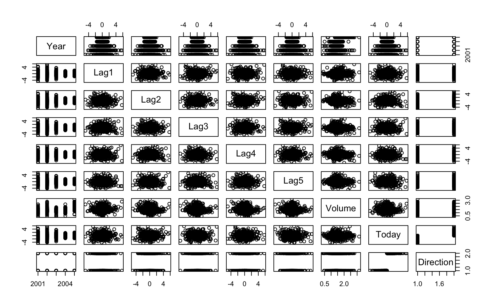
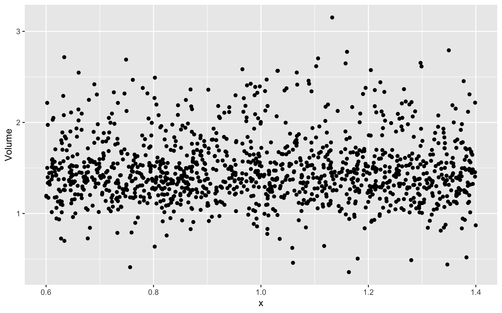

# Chapter 4 Lab


```r
knitr::opts_chunk$set(dpi = 200, fig.width = 8, fig.height = 5, message = F, warning = F)

library(MASS)
library(ISLR)
library(tidyverse)
library(tidymodels)
library(expappr)
library(modelr)

options(scipen=999)

#ezspin_pt(file_name = "ch4", project_directory = ".", file_folder = "munge", keep_html = F)
```

## 4.6.1 Stock Market Data


```r
names(Smarket)
```

```
## [1] "Year"      "Lag1"      "Lag2"      "Lag3"      "Lag4"      "Lag5"     
## [7] "Volume"    "Today"     "Direction"
```

```r
pairs(Smarket)
```



```r
cor(Smarket %>% select(-Direction))
```

```
##              Year         Lag1         Lag2         Lag3         Lag4
## Year   1.00000000  0.029699649  0.030596422  0.033194581  0.035688718
## Lag1   0.02969965  1.000000000 -0.026294328 -0.010803402 -0.002985911
## Lag2   0.03059642 -0.026294328  1.000000000 -0.025896670 -0.010853533
## Lag3   0.03319458 -0.010803402 -0.025896670  1.000000000 -0.024051036
## Lag4   0.03568872 -0.002985911 -0.010853533 -0.024051036  1.000000000
## Lag5   0.02978799 -0.005674606 -0.003557949 -0.018808338 -0.027083641
## Volume 0.53900647  0.040909908 -0.043383215 -0.041823686 -0.048414246
## Today  0.03009523 -0.026155045 -0.010250033 -0.002447647 -0.006899527
##                Lag5      Volume        Today
## Year    0.029787995  0.53900647  0.030095229
## Lag1   -0.005674606  0.04090991 -0.026155045
## Lag2   -0.003557949 -0.04338321 -0.010250033
## Lag3   -0.018808338 -0.04182369 -0.002447647
## Lag4   -0.027083641 -0.04841425 -0.006899527
## Lag5    1.000000000 -0.02200231 -0.034860083
## Volume -0.022002315  1.00000000  0.014591823
## Today  -0.034860083  0.01459182  1.000000000
```

```r
Smarket %>% 
  ggplot(aes(x = 1, Volume)) +
  geom_jitter()
```



## 4.6.2 Logistic Regression


```r
smarket_train <- Smarket %>% filter(Year < 2005)
smarket_test <- Smarket %>% anti_join(smarket_train %>% distinct(Year), by = "Year")

glm_fit <- glm(Direction ~ Lag1 + Lag2 + Lag3 + Lag4 + Lag5 + Volume, family = binomial, data = Smarket, subset = smarket_train)
```

```
## Error in `[.default`(xj, i): invalid subscript type 'list'
```

```r
summary(glm_fit)
```

```
## 
## Call:
## glm(formula = Direction ~ Lag1 + Lag2 + Lag3 + Lag4 + Lag5 + 
##     Volume, family = binomial, data = smarket_train)
## 
## Deviance Residuals: 
##    Min      1Q  Median      3Q     Max  
## -1.302  -1.190   1.079   1.160   1.350  
## 
## Coefficients:
##              Estimate Std. Error z value Pr(>|z|)
## (Intercept)  0.191213   0.333690   0.573    0.567
## Lag1        -0.054178   0.051785  -1.046    0.295
## Lag2        -0.045805   0.051797  -0.884    0.377
## Lag3         0.007200   0.051644   0.139    0.889
## Lag4         0.006441   0.051706   0.125    0.901
## Lag5        -0.004223   0.051138  -0.083    0.934
## Volume      -0.116257   0.239618  -0.485    0.628
## 
## (Dispersion parameter for binomial family taken to be 1)
## 
##     Null deviance: 1383.3  on 997  degrees of freedom
## Residual deviance: 1381.1  on 991  degrees of freedom
## AIC: 1395.1
## 
## Number of Fisher Scoring iterations: 3
```

```r
smarket_binom <- smarket_test %>% 
  as.tibble() %>% 
  augment(glm_fit, newdata = ., type.predict = "response") %>% 
  mutate(pred_direction = ifelse(.fitted > .5, "Up", "Down"))

smarket_binom %>%
  count(Direction, pred_direction)
```

```
## # A tibble: 4 x 3
##   Direction pred_direction     n
##   <fct>     <chr>          <int>
## 1 Down      Down              77
## 2 Down      Up                34
## 3 Up        Down              97
## 4 Up        Up                44
```

```r
smarket_binom %>% 
  summarise(correct_pred_pct = mean(Direction == pred_direction))
```

```
## # A tibble: 1 x 1
##   correct_pred_pct
##              <dbl>
## 1            0.480
```

Remove some variables


```r
glm_fit2 <- glm(Direction ~ Lag1 + Lag2, data = smarket_train, family = binomial)

smarket_binom2 <- smarket_test %>% 
  as.tibble() %>% 
  augment(glm_fit2, newdata = ., type.predict = "response") %>% 
  mutate(pred_direction = ifelse(.fitted > .5, "Up", "Down"))

smarket_binom2 %>%
  count(Direction, pred_direction)
```

```
## # A tibble: 4 x 3
##   Direction pred_direction     n
##   <fct>     <chr>          <int>
## 1 Down      Down              35
## 2 Down      Up                76
## 3 Up        Down              35
## 4 Up        Up               106
```

```r
smarket_binom2 %>% 
  summarise(correct_pred_pct = mean(Direction == pred_direction))
```

```
## # A tibble: 1 x 1
##   correct_pred_pct
##              <dbl>
## 1            0.560
```

